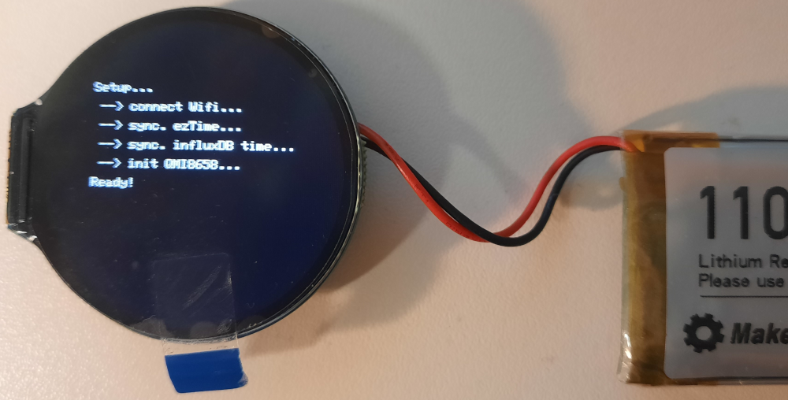
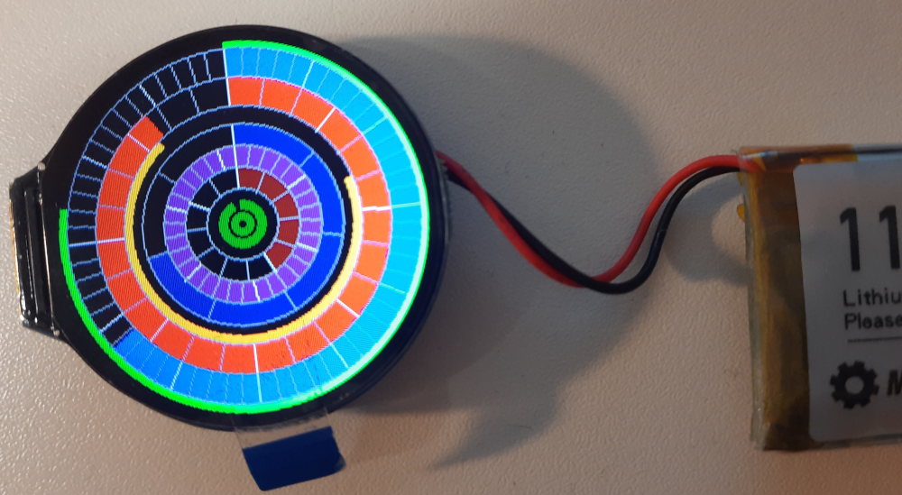

# Kreis-Uhr

Ungewöhnliche Darstellungen von Datum/Uhrzeit finde ich interessant! Deshalb mal hier eine Variante, die:

+ der "üblichen"" Analog-Uhren-Darstellung in Form eines Kreises entspricht

+ allerdings in Fall der Uhrzeit eine eindeutige Skaleneinteilung (60s/60m/24h) verwendet, welche bei 0° beginnt

+ diese Abbildungsweise auch für Wochentag/Kalendertag/Monat etc. sowie Systemzustände verwendet  

## Hardware

* [https://www.waveshare.com/esp32-s3-lcd-1.28.htm]
* [https://www.waveshare.com/wiki/ESP32-S3-LCD-1.28]

## Boot-Bildschirm

## Uhr-Bildschirm

Bedeutung Kreise (von außen nach innen):

* Uhrzeit
  * Sekunden
  * Minuten
  * Stunden
  * Sonne (Aufgang/Untergang)
* Kalender
  * Wochentag (Montag ... Sonntag)
  * Tag (im Monat)
  * Monat (im Jahr)
* Hardware-Status
  * "Füllstand" Akku (...Berechnung bestimmt noch nicht korrekt...!)
  * Zeit via NTP synchronisiert? (grün/rot) 

...auf obigen Bild ist es: 21:38:47 am 31.05., welcher ein Freitag ist; der Ladezustand des Akkus sieht ganz gut aus; die Zeit ist, im vorgegebenen Intervall, via NTP synchronisiert worden...

## Programmablauf:

* Initialisierung Hardware
* Verbindung mit WLAN
* Zeit via NTP initialisieren
* WiFi-Hardware ausschalten
* zyklisches Messen der Batteriespannung
* zykliches Aktivierten der Wifi-Hardware etc.
  * Synchronistaion Zeit via NTP
  * gesammelte Batteriespannungswerte in InfluxDB abspeichern (wenn Define INFLUX gesetzt ist)
  * WiFi-Hardware ausschalten
* Bewegungssensor -> wenn Uhr bewegt wird, dann Hintergrundbeleuchtung einschalten; nach 60s Ruhe wieder ausschalten

## Update September 2026

Aus verschiedenen Gründen, habe ich dieses Projekt nochmal aus der Versenkung geholt und modifiziert:

* die Bibliothek [ezTime](https://github.com/ropg/eztime) ist irgendwie nicht besonders "cool" und teilweise auch fehlerhaft

* ich habe ein wenig mit NTP-Clients/-Servern rumexperimentiert ([GPS-Clock-NTP-Server](https://github.com/boerge42/GPS-Clock-NTP-Server)) und hier entsprechend eingebaut

* ...gleiches gilt auch in Bezug auf FreeRTOS ([FreeRTOS-NTP-Client](https://github.com/boerge42/FreeRTOS-NTP-Client))

Entstanden ist eine Version, welche:

+ keine Daten an eine InfluxDB übermittelt, weil die Batteriespannung nicht mehr gemessen wird (damit ist auch das Ein-/Ausschalten der Hintergrundbeleuchtung und des WLANs, in Abhängigkeit des Gyroscopes entfallen...)

+ die Vebindung zum WLAN via [WiFi-Manager](https://github.com/tzapu/WiFiManager) aufbaut

+ insgesamt via FreeRTOS-Tasks arbeitet

+ die Ausgabe von Datum/Uhrzeit/Status etc. in Abhängigkeit der Ausrichtung des Displays  gestaltet (analog: [Hochzeitstagsuhr](https://github.com/boerge42/Hochzeitstaguhr))

+ einen "Cheat-Mode" anbietet

...und in das übriggebliebene Gehäuse aus dem Projekt "[Hochzeitstagsuhr](https://github.com/boerge42/Hochzeitstaguhr)" eingebaut wurde.

---------

Have fun!

Uwe Berger; 2024, 2026