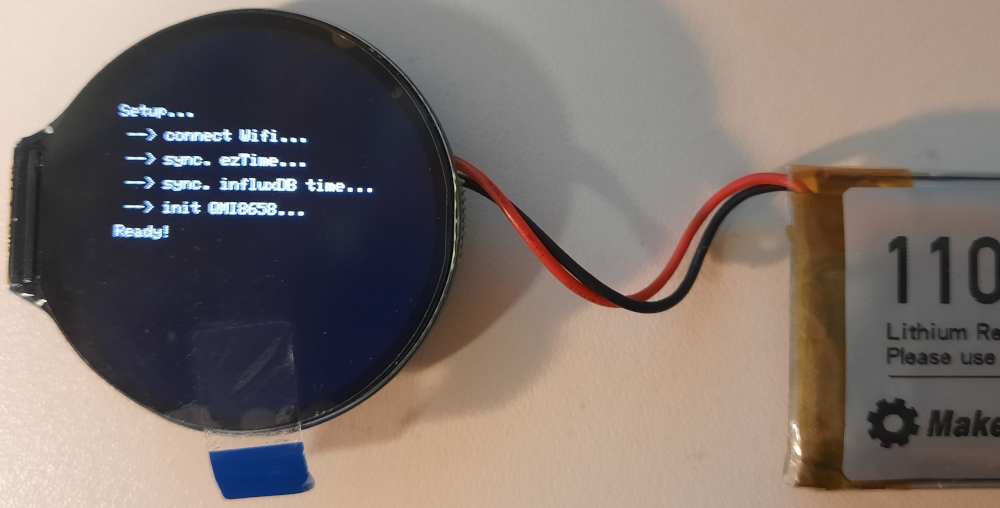
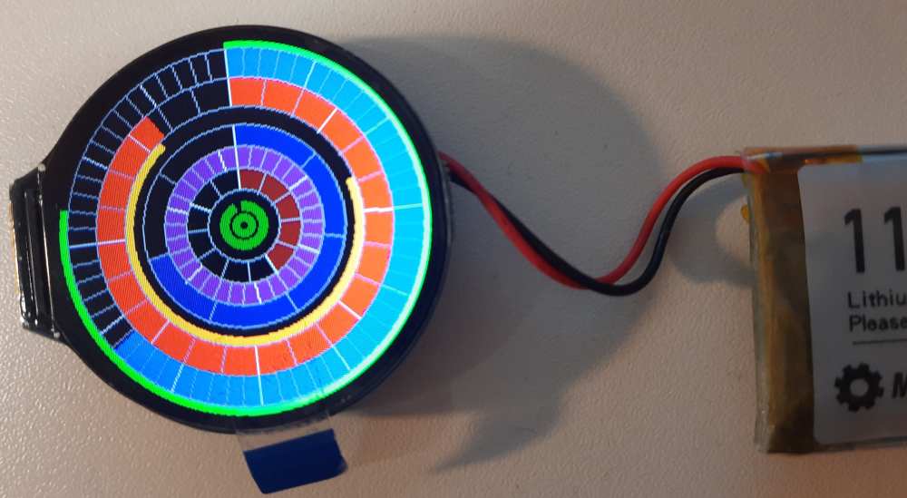

# Kreis-Uhr

## Hardware
  * [https://www.waveshare.com/esp32-s3-lcd-1.28.htm]
  * [https://www.waveshare.com/wiki/ESP32-S3-LCD-1.28]

## Boot-Bildschirm

## Uhr-Bildschirm

Bedeutung Kreise (von außen nach innen):

* Uhrzeit
    * Sekunden
    * Minuten
    * Stunden
    * Sonne (Aufgang/Untergang)
* Kalender
    * Wochentag (Montag ... Sonntag)
    * Tag (im Monat)
    * Monat (im Jahr)
* Hardware-Status
    * "Füllstand" Akku (...Berechnung bestimmt noch nicht korrekt...!)
    * Zeit via NTP synchronisiert? (grün/rot) 

...auf obigen Bild ist es: 21:38:47 am 31.05., welcher ein Freitag ist; der Ladezustand des Akkus sieht ganz gut aus; die Zeit ist, im vorgegebenen Intervall, via NTP synchronisiert worden...

## Programmablauf:
* Initialisierung Hardware
* Verbindung mit WLAN
* Zeit via NTP initialisieren
* WiFi-Hardware ausschalten
* zyklisches Messen der Batteriespannung
* zykliches Aktivierten der Wifi-Hardware etc.
    * Synchronistaion Zeit via NTP
    * gesammelte Batteriespannungswerte in InfluxDB abspeichern
    * WiFi-Hardware ausschalten

---------
Have fun!

Uwe Berger; 2024